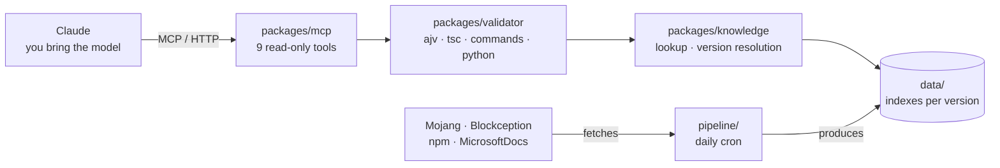

<div align="center">

# CodeCraft

**A validation and data-lookup MCP server for Minecraft Bedrock.**

You bring the model. CodeCraft does not generate anything — it measures
whether what was generated is actually going to work.

[](https://github.com/TanerTalas/codecraft/actions/workflows/data.yml)
[](LICENSE)
[](docs/MCP.md)
[](data/1.26.40.5/index.json)

**[Usage site](https://codecraft-ashy-seven.vercel.app/)** · setup, tool
reference, and where validation ends

</div>

---

## Why it exists

In Bedrock, **a field name recalled slightly wrong produces output that
silently does not work.** No error message, no red line. Everything looks fine
until the pack is loaded into the game.

A real example — both lines pass the schema, one of them never loads:

```diff
  "modules": [
-   { "type": "javascript", "entry": "scripts/main.js" }
+   { "type": "script", "language": "javascript", "entry": "scripts/main.js" }
  ]
```

With the top line the pack **did not appear in the behavior pack list at all.**
It did not even raise an error. The `javascript` type is left over from before
1.16 and the schemas keep it for backward compatibility, but it does not load
with `@minecraft/server` 2.x. The schema says "valid type", the game says "I
cannot load this type".

That one line was measured in the real game (30-08-2026). There are seven more
classes like it, all in [`docs/VALIDATION-LIMITS.md`](docs/VALIDATION-LIMITS.md)
with `ContentLog` evidence.

CodeCraft closes that gap: **values are read from version-pinned data,** and
output is validated against the official schema and against a real `tsc`.

## Nine tools

All nine are read-only. The server writes nothing, sends data nowhere, and
keeps no user data.

| Tool | What it returns | When |
|---|---|---|
| `check_feasibility` | Whether Bedrock can do this at all; if not, why, and the alternative | **Before** anything is generated |
| `get_version_info` | Which version number goes where, which modules, which `format_version`s are valid | Before writing files |
| `get_schema` | The required fields and the field list at that node | Before writing files |
| `lookup_id` | Whether an identifier exists, what type it is, what block states it has | For every identifier recalled from memory |
| `validate_json` | Schema errors carrying a JSON pointer | For every JSON file produced |
| `validate_command` | Command, arity, selector, block state | Before handing over a command |
| `validate_script` | Real `tsc` diagnostics with line, column and TS code | For every API call |
| `validate_python` | Syntax, embedded commands, and the `/connect` envelope | For out-of-game automation scripts |
| `review_pack` | Every file, plus the things a schema structurally cannot see | The last step before handing anything over |

The order is not alphabetical, it is the **order of use** — and `tools/list`
preserves it.

## Setup

| | |
|---|---|
| Endpoint | `https://codecraft-ashy-seven.vercel.app/mcp` |
| Usage site | [`codecraft-ashy-seven.vercel.app`](https://codecraft-ashy-seven.vercel.app/) — four pages: home, setup, tools, limits |
| Transport | Stateless Streamable HTTP, `POST` only |
| Authentication | None — the endpoint is read-only and returns nothing private |

In Claude, open **Customize → Connectors** (*not* Settings; older guides point
there, and there is no custom connector field on that screen):

1. Customize → Connectors → add a custom connector
2. Paste the endpoint address
3. Save

Three things you should see once it connects — a single "it worked" is not
enough:

- The tool count is **9**, complete
- The client classifies them as **"read only tools"** — a separate permission class
- Our own titles are visible, e.g. *"Can Bedrock do this"* — the tool surface is English

More: [`docs/MCP.md`](docs/MCP.md)

## Where validation ends

This table is not advertising, it is a statement of limits. "Passed validation"
and "works in the game" are not the same thing — eight classes of error get
through validation and break in the game, and every one of them was measured in
a real game.

| Class | Does the schema catch it | What CodeCraft does |
|---|---|---|
| **A** · identity reference | No, but resolvable | `checkIdentities` finds it |
| **A′** · path / sound reference | No | `checkReferences`, `checkSounds` — warning; the game itself says nothing |
| **B** · filename ↔ identifier | **Structurally no** | `checkFileNames` tells you the right name |
| **C** · texture / asset reference | No | `checkAssets` checks against the vanilla atlas |
| **D** · valid but not intended | **Structurally no** | `checkPatterns` measures the known patterns |
| **E** · manifest that never loads | No — the stale type is still listed | `checkManifest` names the right type |
| **F** · Molang | No — nothing looks inside the string | `checkMolang`; `unknown-query` is an **error**, measured in game |
| **G** · component name | No — both schema sources let it through | `checkComponents`, still a **warning** (see below) |
| **H** · version-dependent required field | **Structurally no** — the requirement rides on `format_version` | `checkRecipes` — **error**, the recipe never loads |

> **F and G are worth reading twice.** The game rejects both exactly as hard —
> the whole block definition is dropped. F was raised to error and G was not,
> because our own component index has a measured gap of **126 names**. What
> decides severity is not only "what does the game do" but "how complete is our
> list" — two separate questions, and neither is answered without measuring.

The tools **find and report, they do not write** — the endpoint is read-only,
fixing is the caller's job. The half that is still open is written down too:
[`docs/VALIDATION-LIMITS.md`](docs/VALIDATION-LIMITS.md)

## Bedrock has five separate version numbers

This is where the confusion hurts most, and it is half the reason the tool
exists:

| Number | Example | Where it is used |
|---|---|---|
| Marketing number | `26.40` | Announcements only. **Never written into any file** |
| Game / data version | `1.26.40.5` | `data/` folder name, data indexes |
| `min_engine_version` | `[1, 26, 40]` | `manifest.json` — a three-part array |
| `@minecraft/server` module version | `2.9.0` | `manifest.json` → `dependencies` |
| `format_version` | `1.21.100`, `1.13.0`, `2` | Content files |

**`format_version` is an axis of its own and has nothing to do with the game
version:** it is the schema version of that file type. Block `1.21.100`, feature
rule `1.13.0`, spawn rule `1.8.0`, manifest `2`. It does not change when the
game version changes.

The module version is a trap of its own — the game version arrives *embedded
inside* the prerelease tag:

```
2.9.0                              stable module version (npm "latest")
2.11.0-beta.1.26.50-preview.27     module 2.11.0, game 1.26.50-preview.27
```

Correct values are not recalled, they are **read from the schema** — which is
exactly what `get_schema` and `get_version_info` are for.

## Architecture



Dependencies point one way: `mcp → validator → knowledge → data`. Nothing
imports backwards.

**There is no build step.** Node runs the `.ts` files directly; `tsc` is used
only for type checking and, as a subprocess, for `validate_script`.

## Data

`data/` is not a database — it is a set of indexes that live in git and are
versioned there. Eight collectors produce it from four upstream sources.

| Source | What it gives | License |
|---|---|---|
| `Mojang/bedrock-samples` | Block/item/entity identifiers, command grammar, texture atlas | Minecraft EULA — *derived facts only* |
| `Blockception/…json-schemas` | The schemas validation runs against | BSD-3-Clause |
| npm `@minecraft/*` | Script type definitions | MIT |
| `MicrosoftDocs/minecraft-creator` | Release notes | CC-BY-4.0 |

A scheduled GitHub Action refreshes it, and a freshness check reports when the
data goes stale. The cron is set to 05:00 UTC — but it **does not run then.**
All five scheduled runs measured on 03-09-2026 started late, the earliest by
4h24m, ~5h on average; GitHub queues scheduled jobs and delays them under load.
So the indexes can be up to **1 day + ~5 hours** old.

Raw upstream data **never enters the repo.** Only derived facts are indexed:
whether an identifier exists, the name of a field, a version number. Reasoning
and measurements: [`docs/SOURCES.md`](docs/SOURCES.md)

## Invariants

1. **The validation layer never calls an LLM.** No package in this repo depends
   on an LLM SDK. The rule is not a sentence, it is a measurement:
   `packages/mcp/test/no-llm.test.ts`
2. **The endpoint is read-only.** All nine tools carry `readOnlyHint`
3. **`data/` lives in git.** No database
4. **The free tier is a requirement, not a constraint**
5. **Raw upstream data never enters the repo**

## How measurement is written down

In this repo, **"it works" and "it was measured" are different things.** A claim
is written only once it has been measured, and how it was measured is written
next to it — with the date. A measurement that turns out wrong is not deleted;
it is struck through and where it went is written down.

That is what the "measured (date)" comments in the code are: each one is the
record of something that really did break, once.

## Documents

The documents below are in Turkish — they are the developer's notebook. The
product surface is English: the tools, the server instructions, every finding
and error message, and the site.

| | |
|---|---|
| [`CLAUDE.md`](CLAUDE.md) | Architecture, invariants, version axes |
| [`docs/MCP.md`](docs/MCP.md) | Endpoint, setup, tool contract |
| [`docs/mcp-kullanim.md`](docs/mcp-kullanim.md) | The tools in real use, measurement log |
| [`docs/site-icerik.md`](docs/site-icerik.md) | The usage site's content and measurement log |
| [`docs/SOURCES.md`](docs/SOURCES.md) | Data sources and their licenses |
| [`docs/VALIDATION-LIMITS.md`](docs/VALIDATION-LIMITS.md) | What validation does not catch |
| [`docs/COMMANDS.md`](docs/COMMANDS.md) | Command validation and its scope |
| [`docs/WEBSOCKET.md`](docs/WEBSOCKET.md) | The WebSocket bridge and its measurement |

## License

The code is [Apache-2.0](LICENSE). The repo carries third-party content under
three separate licenses and produces data derived from a fourth —
[`THIRD-PARTY-NOTICES.md`](THIRD-PARTY-NOTICES.md) says which is which.

---

<div align="center">

**NOT AN OFFICIAL MINECRAFT PRODUCT.**
**NOT APPROVED BY OR ASSOCIATED WITH MOJANG OR MICROSOFT.**

</div>
