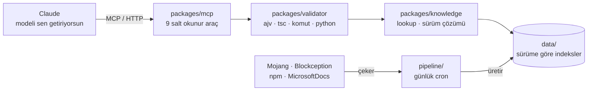

<div align="center">

# CodeCraft

**Minecraft Bedrock için doğrulama ve veri sorgulama MCP sunucusu.**

Modeli sen getiriyorsun. CodeCraft üretmiyor — üretilenin gerçekten
çalışıp çalışmayacağını ölçüyor.

[](https://github.com/TanerTalas/codecraft/actions/workflows/data.yml)
[](LICENSE)
[](docs/MCP.md)
[](data/1.26.40.5/index.json)

</div>

---

## Neden var

Bedrock'ta **yanlış hatırlanan bir alan adı sessizce çalışmayan çıktı üretir.**
Hata mesajı yok, kırmızı satır yok. Paket oyuna yüklenene kadar her şey yolunda
görünür.

Gerçek bir örnek — ikisi de şemadan geçiyor, biri oyunda hiç yüklenmiyor:

```diff
  "modules": [
-   { "type": "javascript", "entry": "scripts/main.js" }
+   { "type": "script", "language": "javascript", "entry": "scripts/main.js" }
  ]
```

Üstteki satırla paket, davranış paketleri listesinde **hiç görünmedi.** Hata
bile vermedi. Sebep: `javascript` tipi 1.16 öncesinden kalma, şemalar geriye
dönük uyumluluk için listede tutuyor ama `@minecraft/server` 2.x ile
yüklenmiyor. Şema "geçerli tip" diyor, oyun "bu tiple yükleyemem" diyor.

Bu tek satır gerçek oyunda ölçüldü (30-08-2026). Aynı sınıftan dört tane daha
var — hepsi `docs/VALIDATION-LIMITS.md` içinde, `ContentLog` kanıtıyla.

CodeCraft bu boşluğu kapatıyor: **değerler sürüme kilitli veriden okunuyor,**
çıktı resmi şemaya ve gerçek `tsc`'ye karşı doğrulanıyor.

## Dokuz araç

Dokuzu da salt okunur. Sunucu hiçbir şey yazmıyor, hiçbir yere veri
göndermiyor, kullanıcı verisi tutmuyor.

| Araç | Ne döndürür | Ne zaman |
|---|---|---|
| `check_feasibility` | Engelin sebebi, kanıtı ve alternatifi | Üretimden **önce** |
| `get_version_info` | Sürüm alanları, modüller, geçerli `format_version`'lar | Dosya yazmadan önce |
| `get_schema` | Zorunlu alanlar ve o düğümdeki alan listesi | Dosya yazmadan önce |
| `lookup_id` | Kimlik var mı, hangi tür, blok durumları | Hatırlanan her kimlik için |
| `validate_json` | JSON pointer'lı şema hataları | Ürettiğin her JSON için |
| `validate_command` | Komut, arity, seçici, blok durumu | Komut vermeden önce |
| `validate_script` | Satır, sütun ve TS koduyla gerçek `tsc` tanısı | Her API çağrısı için |
| `validate_python` | Sözdizimi, gömülü komutlar ve `/connect` zarfı | Dış otomasyon script'i için |
| `review_pack` | Bütün dosyalar, artı şemanın yakalayamadıkları | Vermeden önceki son adım |

Sıra alfabetik değil, **kullanım sırası** — ve `tools/list` bu sırayı koruyor.

## Kurulum

| | |
|---|---|
| Uç | `https://codecraft-ashy-seven.vercel.app/mcp` |
| Transport | Durumsuz Streamable HTTP, yalnızca `POST` |
| Kimlik doğrulama | Yok — uç salt okunur, gizli veri döndürmüyor |

Claude'da **Customize → Connectors** (Settings *değil*; eski rehberler orayı
gösteriyor ve orada özel bağlayıcı alanı yok):

1. Customize → Connectors → özel bağlayıcı ekle
2. Uç adresini yapıştır
3. Kaydet

Bağlandıktan sonra görülmesi gereken üç şey — tek bir "çalıştı" cümlesi yetmez:

- Araç sayısı **9**, eksiksiz
- İstemcinin sınıflandırması: **"read only tools"** (ayrı bir izin sınıfı)
- Kendi başlıklarımız, örn. *"Can Bedrock do this"* — araç yüzeyi İngilizce

Ayrıntı: [`docs/MCP.md`](docs/MCP.md)

## Doğrulamanın bittiği yer

Bu tablo bir reklam değil, bir sınır beyanı. "Doğrulamadan geçti" ile "oyunda
çalışıyor" aynı şey değil — beş hata sınıfı doğrulamadan geçip oyunda patlıyor
ve hepsi gerçek oyunda ölçüldü.

| Sınıf | Şema yakalar mı | CodeCraft ne yapıyor |
|---|---|---|
| **A** · kimlik referansı | Hayır, ama çözülebilir | `checkIdentities` bulur |
| **B** · dosya adı ↔ identifier | **Yapısal olarak hayır** | `checkFileNames` doğru adı söyler |
| **C** · doku/asset referansı | Hayır | `checkAssets` vanilla atlasına bakar |
| **D** · geçerli ama amaçlanmayan | **Yapısal olarak hayır** | `checkPatterns` bilinen kalıpları ölçer |
| **E** · yüklenmeyen manifest | Hayır — eski tip listede | `checkManifest` doğru tipi söyler |

Araçlar **buluyor ve söylüyor, yazmıyor** — uç salt okunur, düzeltme çağıranın
işi. Kapatılmayan yarısı da yazılı:
[`docs/VALIDATION-LIMITS.md`](docs/VALIDATION-LIMITS.md)

## Bedrock'ta beş ayrı sürüm numarası var

En çok can yakan karışıklık burası ve aracın var olma sebebinin yarısı bu:

| Numara | Örnek | Nerede kullanılır |
|---|---|---|
| Pazarlama numarası | `26.40` | Sadece duyurularda. **Hiçbir dosyaya yazılmaz** |
| Oyun / veri sürümü | `1.26.40.5` | `data/` klasör adı, veri indeksleri |
| `min_engine_version` | `[1, 26, 40]` | `manifest.json` — üç parçalı dizi |
| `@minecraft/server` modül sürümü | `2.9.0` | `manifest.json` → `dependencies` |
| `format_version` | `1.21.100`, `1.13.0`, `2` | İçerik dosyaları |

**`format_version` oyun sürümüyle ilgisi olmayan ayrı bir eksen:** o, dosya
tipinin kendi şema sürümü. Blok `1.21.100`, feature rule `1.13.0`, spawn rule
`1.8.0`, manifest `2`. Oyun sürümü değişince değişmez.

Modül sürümü de ayrı bir tuzak — oyun sürümü prerelease etiketinin *içine
gömülü* geliyor:

```
2.9.0                              kararlı modül sürümü (npm "latest")
2.11.0-beta.1.26.50-preview.27     modül 2.11.0, oyun 1.26.50-preview.27
```

Doğru değerler hatırlanmaz, **şemadan okunur** — `get_schema` ve
`get_version_info` tam bunun için var.

## Mimari



Bağımlılık yönü tek taraflı: `mcp → validator → knowledge → data`.
Ters yönde import yok.

**Derleme adımı yok.** Node `.ts` dosyalarını doğrudan koşuyor; `tsc` yalnızca
tip kontrolü ve `validate_script` için alt süreç olarak açılıyor.

## Veri

`data/` bir veritabanı değil, git'te duran ve versiyonlanan indeksler.
Dört dış kaynaktan sekiz toplayıcıyla üretiliyor ve **her sabah 05:00 UTC**
otomatik tazeleniyor; veri bayatlarsa bildirim geliyor.

| Kaynak | Ne veriyor | Lisans |
|---|---|---|
| `Mojang/bedrock-samples` | Blok/item/entity kimlikleri, komut grameri, doku atlası | Minecraft EULA — *yalnızca türetilmiş olgu* |
| `Blockception/…json-schemas` | Doğrulamanın kullandığı şemalar | BSD-3-Clause |
| npm `@minecraft/*` | Script tip tanımları | MIT |
| `MicrosoftDocs/minecraft-creator` | Sürüm notları | CC-BY-4.0 |

Ham kaynak verisi repoya **girmez.** Sadece ondan türetilen olgular
indekslenir: bir kimliğin var olup olmadığı, bir alanın adı, bir sürüm
numarası. Gerekçe ve ölçümler: [`docs/SOURCES.md`](docs/SOURCES.md)

## Değişmezler

1. **Doğrulama katmanı LLM çağırmaz.** Depo genelinde hiçbir paket bir LLM
   SDK'sına bağlanmaz. Kural laf olarak değil ölçüyle duruyor:
   `packages/mcp/test/no-llm.test.ts`
2. **Uç salt okunur.** Dokuz aracın dokuzu da `readOnlyHint`
3. **`data/` git içinde durur.** Veritabanı yok
4. **Ücretsiz kademe bir kısıt değil, gereksinim**
5. **Ham kaynak verisi repoya girmez**

## Ölçüm yazma kuralı

Bu depoda **"çalışıyor" ile "ölçüldü" ayrı şeyler.** Bir iddia ancak
ölçüldüğünde yazılır, nasıl ölçüldüğü yanına yazılır — tarihiyle birlikte.
Yanlış çıkan bir ölçüm silinmez, üstü çizilir ve nereye gittiği yazılır.

Koddaki "ölçüldü (tarih)" yorumları bu yüzden var: her biri bir kez gerçekten
patlamış bir şeyin kaydı.

## Belgeler

| | |
|---|---|
| [`CLAUDE.md`](CLAUDE.md) | Mimari, değişmezler, sürüm eksenleri |
| [`docs/MCP.md`](docs/MCP.md) | Uç, kurulum, araç sözleşmesi |
| [`docs/mcp-kullanim.md`](docs/mcp-kullanim.md) | Araçların gerçek kullanımı, ölçüm günlüğü |
| [`docs/SOURCES.md`](docs/SOURCES.md) | Veri kaynakları ve lisansları |
| [`docs/VALIDATION-LIMITS.md`](docs/VALIDATION-LIMITS.md) | Doğrulamanın yakalayamadıkları |
| [`docs/COMMANDS.md`](docs/COMMANDS.md) | Komut doğrulama ve kapsamı |
| [`docs/WEBSOCKET.md`](docs/WEBSOCKET.md) | WebSocket köprüsü ve ölçümü |

## Lisans

Kod [Apache-2.0](LICENSE). Depo üç ayrı lisansa tabi üçüncü taraf içerik
taşıyor ve bir dördüncüsünden türetilmiş veri üretiyor —
[`THIRD-PARTY-NOTICES.md`](THIRD-PARTY-NOTICES.md) hangisinin hangisi olduğunu
söyler.

---

<div align="center">

**NOT AN OFFICIAL MINECRAFT PRODUCT.**
**NOT APPROVED BY OR ASSOCIATED WITH MOJANG OR MICROSOFT.**

<sub>Resmi bir Minecraft ürünü değildir. Mojang veya Microsoft tarafından
onaylanmamıştır ve onlarla ilişkili değildir.</sub>

</div>
